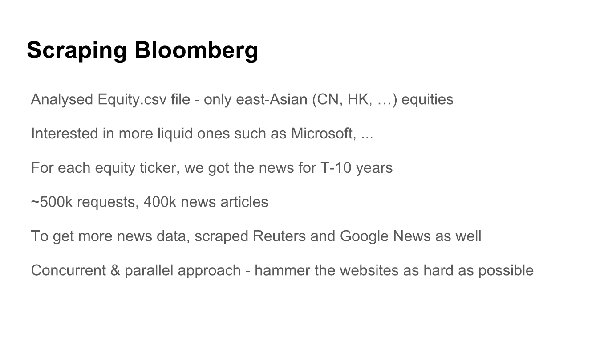
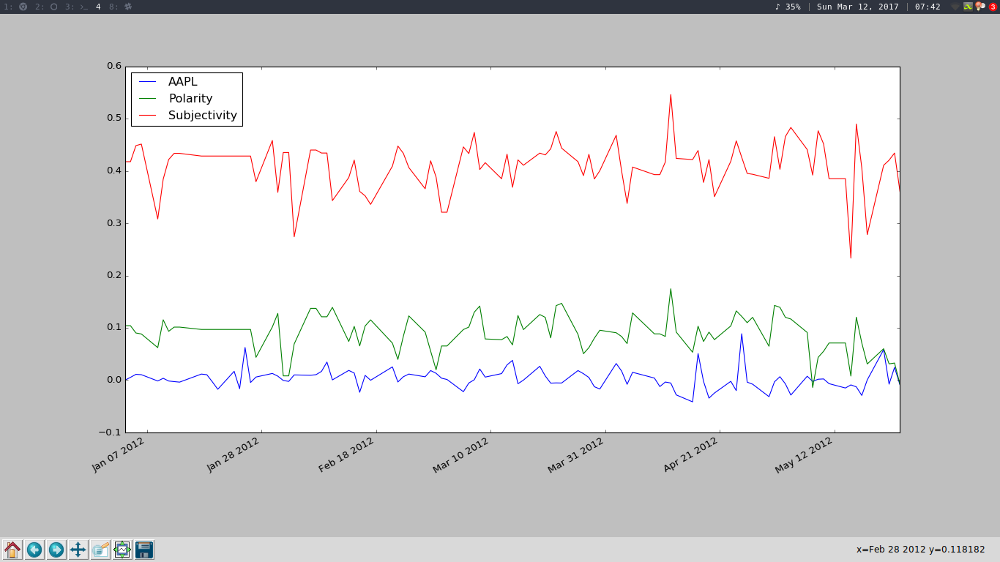
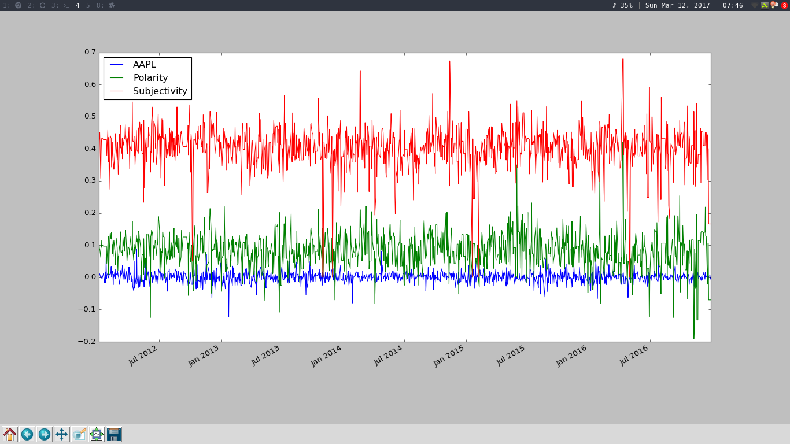

# UCL Data Science Student Challenge

## Category 1: To demonstrate if asset prices react to news and events

We did sentiment analysis on news stories of a particular stock and then used
Microsoft Azure to find out how they affected the stock price.

### Scraping

We wrote a Python script to scrape news articles from Reuters. We scraped news articles
for the AAPL, GOOG and MSFT stock for each day in the past ten years. We combined all
the news articles on a particular day and used TextBlob to do sentiment anaylsis
on it.

We also used Pandas to fetch stock price data from Yahoo Finance for the past ten years.
We then combined the stock price data with the sentiment of the news articles.
We then calculated the daily returns for each of the stock. So for each
stock we had the daily return and the sentiment (polarity and subjectivity) for the past
10 years.

### Machine Learning
We used Azure ML to build a Neural Network to predict the return of a stock by
looking at the sentiment of the news for the stock for the current day.
